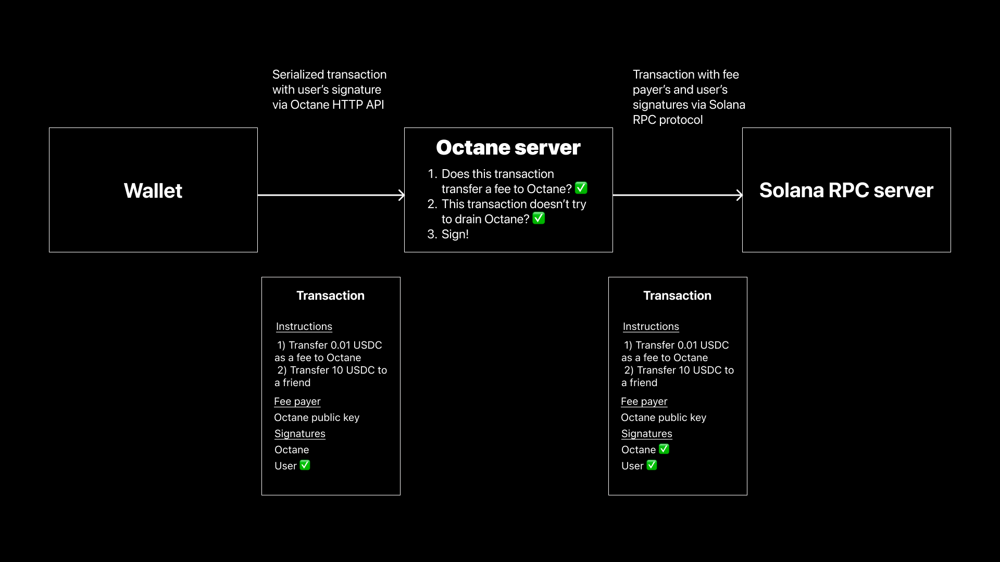

# Octane ⛽

1. [What is Octane?](#what-is-octane)
2. [How does it work?](#how-does-it-work)
3. [Getting started](#getting-started)
4. [Security](#security)
5. [Contributing](#contributing)

## What is Octane?

Octane is a gasless transaction relayer for Solana. Octane accepts transactions via an HTTP API, signs them if they satisfy certain conditions and broadcasts to the network.

It's designed for anyone to be able to run for free on Vercel as a collection of serverless Node.js API functions.

Transaction fees on Solana are very inexpensive, but users still need SOL to pay for them, and they often don't know (or forget) this.

## How does it work?

Octane provides an API that lets users pay for transactions with SPL token transfers instead of native SOL.

It leverages unique properties of Solana:

1) Transaction can have multiple signers, one of whom is the transaction fee payer. There is no single "msg.sender".

2) Transaction can have multiple instructions interacting with different programs that are executed atomically. If one instruction fail, whole transactions fails.

3) Each instruction refers to accounts it touches as writable or readable. It allows to validate transactions before signing.

A user creates a transaction that contains an instruction for a small token transfer to Octane, along with whatever else their transaction is supposed to do.

The user partially signs the transaction, authorizing it to make the transfer, and so it can't be modified by Octane or MITM attacks.

The user sends the serialized transaction to an Octane REST API endpoint.

Octane validates the transaction, signs it to pay the SOL, and broadcasts it on the Solana network.

When the transaction is confirmed, Octane will have been paid a fee in the token for this service.

## Getting started

1. You can use Octane as a server application to deploy on a platform like Render or Vercel.
2. You can use someone else's node. This way you don't have to support your own server and manage funds on fee payer account. However, you'll be limited by SPL tokens they offer at their price per signature.
3. You can integrate Octane into your backend by using it as a Node.js library.

Get an overview of Octane's use cases and how to implement them in [Recipes](docs/recipes.md).

### Setting up your own node

You can get started by following the steps in [SETUP](SETUP.md). You'll need to support a fee payer account and manage prices in `config.json`

### Using Octane from a client app

If you already have set up an Octane node, or you are using a public endpoint from someone else, it's the time to integrate the node with your client code. Follow [this guide](docs/example-integration.md) to run your first transaction through Octane. You can also view all Octane endpoints and their parameters on [this page](docs/endpoints.md).

### Integrate it as a Node.js library

If you would like to Octane as part of your backend, learn about installation and available methods in [this guide](docs/library.md).

### Managing fee payer account

If you host your own Octane node, you'll need to manage fee payer account. Octane provides a handy CLI for that: it allows to swap tokens to SOL, create accounts and generate config. Go through [this guide](docs/CLI.md) to learn more.

### Example app

[octane-demo](https://github.com/sevazhidkov/octane-demo) is an open source app that showcases various types of gasless transactions using Octane:
* gasless token transfer (equivalent to any other simple transaction)
* transaction sponsorship for authorized users, including limits and usage of octane-core
* gasless swaps from tokens to SOL
* just-in-time swaps to run Metaplex NFT mints and Anchor programs

### Common integration scenarios

1. **For wallets**: let your users pay transaction fees and associated account initialization fees with liquid SPL tokens.
2. **For wallets**: let your users convert liquid SPL tokens to SOL without paying any fees in SOL.
3. **For wallets and dapps**: convert tokens to SOL when a user doesn't have enough SOL to execute a transaction.
4. **For dapps and ecosystems**: fully sponsor transactions for authorized users.
5. **For dapps with tokens**: let your users pay transaction fees in your token.

Learn more about these use cases in [Recipes](docs/recipes.md).

## Security

Octane operates trustlessly and is designed to be easily run by anyone in an adversarial environment.

It uses ratelimiting, transaction validation, and transaction simulation to mitigate DoS, spam, draining, and other attacks.

However, there are some risks associated with running an Octane node:

1) Token-to-SOL price spread. Octane is configured to accept specific amounts of SPL tokens for paying fixed transaction fees in SOL. Since the token price relative to SOL can change, Octane could end up in a state where it loses money on every transaction.
2) Draining possibilities due to Octane software bugs. Octane signs user-generated transactions with fee payer's keypair after confirming a transaction transfers fee and does not try to modify fee payer's accounts.  However, if implemented checks are insufficient due to a bug, an attacker could run transaction without paying the fee or modify fee payer's accounts.

Follow these recommendations to minimize risks:
1. Run Octane on a new separate keypair, not used in governance or within contracts as an authority.
2. Set SPL token price for transactions with a premium relative to their real cost in SOL.
3. Don't hold more SOL on the keypair than needed for 3-4 hours of spending on transaction fees for your load expectations. It could be as low as 0.2-1 SOL.
4. Every hour automatically received swap tokens to SOL (Octane provides a CLI for that).
5. Regularly check that prices and liquidity of SPL tokens allow your profitably pay for transaction fees in SOL.
6. If your Octane node makes profit, regularly withdraw that profit to another keypair.
7. When using Octane as a library in your backend, make sure to:
    1. Never return fee payer's signature of an unconfirmed transaction to a user. You must submit transaction to the network from the backend.
    2. Implement duplicated transaction checks, limits per user and general rate limits.

## Contributing

Octane is a great way to start contributing in the Solana ecosystem. Since Octane is just an HTTP server written on Typescript, you don't have to know Rust or learn how to build programs on Solana.

Some ideas for your first PRs:
* More tests with various scenarios focused on Octane security
* Docs, guides and example code for new people to get started with Octane
* Add support for more exchange protocols
* Build apps for consumers on top of Octane

Also, you can run your own Octane node and promote it among developers.

### Internals

Octane is built as a monorepo with multiple packages using [Lerna](https://lerna.js.org/).

[Core](https://github.com/solana-labs/octane/tree/master/packages/core) package provides reusable functions that process and sign transactions ("actions").

[Server](https://github.com/solana-labs/octane/tree/master/packages/package) package is a Next.js app that runs the server using API functions. It's also responsible for parsing `config.json` and managing web-specific security tools (CORS and rate limits).

If you want to create a new action (for example, swap on a new protocol), you'll need to add it as an action in Core and add a new endpoint in Server that calls new action.

Octane utilizes cache for some rate limiting, but generally should be stateless.

### Vision

Octane wants to make Solana easier to use by abstracting away some complexity that leads to user confusion and error.

Octane wants to enable SOL-less wallets for new users in crypto, allowing them to operate only in stablecoins.

Octane wants to become integrated with wallets, support multiple tokens with different fees, and perform atomic swaps to pay for transactions or get SOL.

Octane wants to be customizable for decentralized applications that want to sponsor their users transactions.

Octane wants to create a seamless, competitive marketplace for gasless transactions.

Octane wants to be secure, well-tested, well-documented, and easy to use.
