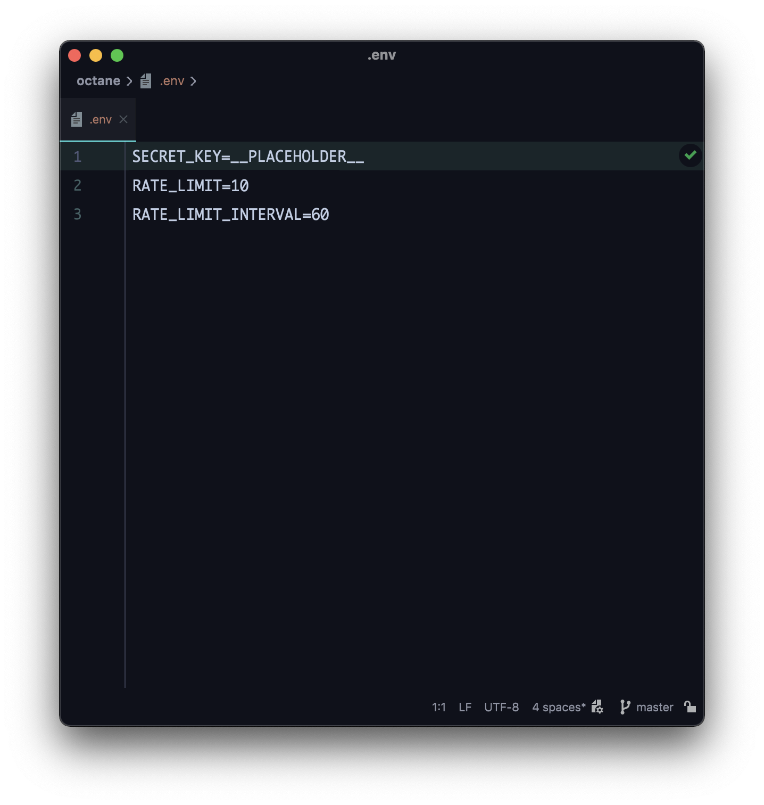

# Set up your own Octane node ⛽

This guide assumes you have:

- a Mac/Linux/WSL environment to run basic shell commands
- a basic code editor
- a Github account
- a Vercel account
- Node.js 14.x (you can use [n](https://github.com/tj/n) to manage versions)
- the [Solana CLI Tools](https://docs.solana.com/cli/install-solana-cli-tools) installed
- the [SPL Token CLI](https://spl.solana.com/token#command-line-utility) installed

If you don't have any of these yet, get them first!

## 1. Fork Octane on Github

Fork the project to create your own deployment of Octane.


If you want to keep your fork private, follow [this guide](https://gist.github.com/0xjac/85097472043b697ab57ba1b1c7530274).

## 2. Clone your fork

From your fork, copy the git link.


From the command line, run these commands:

```shell
git clone https://github.com/<YOUR_GITHUB_USERNAME>/octane

cd octane

yarn install
# OR #
npm install
```

## 3. Configure the environment variables

From the command line, run this command:

```shell
cp packages/server/.env.example packages/server/.env
```

In your editor, open the `packages/server/.env` file.



The values containing `__PLACEHOLDER__` need to be changed.

- `SECRET_KEY` is the base58 encoded secret key that Octane will sign transactions with.

Let's start by creating a keypair and minting a token to test with.

From the command line, run these commands:
```shell
solana-keygen new --no-bip39-passphrase --silent --outfile keys/octane.json

solana config set --keypair `pwd`/keys/octane.json --url https://api.devnet.solana.com

node base58.js `pwd`/keys/octane.json | pbcopy
```

The last command will silently copy the base58 encoded secret key to your clipboard.

Update the value of `SECRET_KEY` in your .env file with it, and save the file.

Now, open the `config.json` file.

These `__PLACEHOLDER__` values must also change.

- `mint` is the base58 encoded public key of an SPL token mint.
- `account` is the base58 encoded public key of an SPL token account corresponding to this mint.

From the command line, run these commands:
```shell
solana airdrop 1

spl-token create-token
```

After the last command, you should see:
```
Creating token <base58 encoded TRANSFER_MINT public key>
```

Copy this **TRANSFER_MINT** public key, update the value of `TRANSFER_MINT` in your `config.json` file with it, and save the file.

From the command line, run these commands:
```shell
source .env

spl-token create-account $TRANSFER_MINT

spl-token mint $TRANSFER_MINT 100
```

After the last command, you should see:
```
Minting 100 tokens
  Token: <base58 encoded TRANSFER_MINT public key>
  Recipient: <base58 encoded TRANSFER_ACCOUNT public key>
```

Copy this **TRANSFER_ACCOUNT** public key, update the value of `TRANSFER_ACCOUNT` in your `config.json` file with it, and save the file.

Now, commit and push your changes to the fork.

You're ready to deploy Octane.

## 4. Login to Vercel

Sign in with Github:


## 5. Create a new project on Vercel

Click the **New Project** button:


## 6. Import your Octane fork

Click the **Import** button:


## 7. Configure the project

You should see:


Edit the **Root Directory** section to `./packages/server`

Expand the *Build and Output Settings* section.

Under **Build Command**, toggle the slider for **Override** and put `cd ../.. && yarn build`.

Expand the **Environment Variables** section.

From your .env file, copy and paste the names and values of each environment variable and click the **Add** button.

When you're done, you should see:


## 8. Deploy the project

Click the **Deploy** button and wait. When the build is finished, you should see:


Click the **Go to Dashboard** button.

## 9. Visit your deployment

Click the **Visit** button from the Dashboard.


You should see a blank page. This is the `index.html` file in the `public` directory. You can customize it if you like.


Navigate to the `/api` path of your deployment. You should see:


This is the `index` API route, which provides information about your deployment's configuration.

## 10. More coming soon

Sorry, this guide isn't finished yet! Octane is new, so please come back soon.
